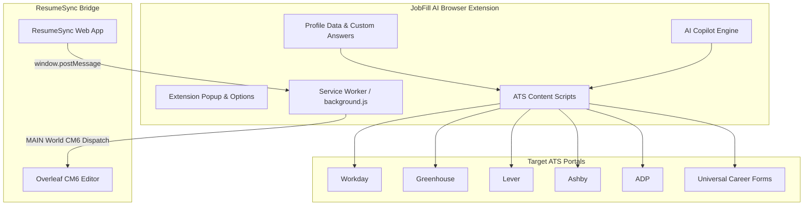

# JobFill AI ⚡

> **One-Click Job & Internship Application Autofiller with AI Question Copilot & Overleaf CodeMirror 6 Sync**

[](https://chrome.google.com/webstore)
[](https://developer.chrome.com/docs/extensions/mv3/intro/)
[](https://resume-sync-jade.vercel.app)
[](LICENSE)

---

## 📖 Overview

**JobFill AI** is an intelligent browser extension built on Chrome Extension Manifest V3 that accelerates the job hunt workflow:
1. **1-Click Application Autofill**: Intelligently detects and populates candidate profiles across all major Applicant Tracking Systems (ATS) and custom corporate career portals.
2. **AI Question Copilot**: Generates contextual, accurate answers to behavioral, diversity, visa sponsorship, and technical short-answer prompts using your verified background.
3. **Overleaf CodeMirror 6 Synchronization Bridge**: Connects with [ResumeSync](https://resume-sync-jade.vercel.app) to inject dynamically tailored LaTeX source code directly into Overleaf's active editor session and triggers automatic recompilation.



---

## ✨ Key Features

### 1. 🚀 Universal 1-Click ATS Autofill
- **Specialized Adapters**:
  - **Workday**: Handles dynamic shadow DOMs, nested multi-step wizards, and custom dropdown pickers.
  - **Greenhouse**: Seamlessly populates required fields, LinkedIn/GitHub links, and demographic surveys.
  - **Lever**: Instant parsing and population of multi-part resumes and social links.
  - **Ashby**: Handles dynamic React-driven inputs and custom questionnaire blocks.
  - **ADP**: Supports legacy and modern enterprise portals.
  - **TikTok & ByteDance**: Custom form handler designed for complex multi-lingual career interfaces.
  - **Universal Fallback**: Heuristic keyword & regex field matcher that fills inputs on any standalone corporate portal.

### 2. 🤖 AI Question Copilot (`ai-copilot.js`)
- Contextually answers open-ended application questions directly inside the page:
  - **Work Authorization & Sponsorship**: Accurately fills US Citizenship, F-1 OPT/CPT, and H-1B sponsorship requirements according to your profile settings.
  - **Behavioral & Short Answer**: Generates punchy, authentic responses to questions like *"Why do you want to work here?"*, *"Describe a technical challenge you solved"*, or *"What is your expected compensation?"*.
  - **EEO / Diversity Demographics**: Auto-fills gender, race/ethnicity, and veteran status in accordance with user preferences.

### 3. 📑 Overleaf CodeMirror 6 Transaction Engine (`background.js`)
- **Direct Memory Injection**: Overleaf runs CodeMirror 6, which ignores standard DOM mutations. JobFill's background script runs with Chrome's `MAIN` execution world to dispatch real CodeMirror transactions:
  ```javascript
  view.dispatch({
    changes: { from: 0, to: view.state.doc.length, insert: latexCode }
  });
  ```
- **Auto-Wait & Recompile**: If your Overleaf project is closed, JobFill opens it, listens via `chrome.tabs.onUpdated` for the document to mount, injects the updated resume, and clicks Overleaf's **Recompile** button automatically.

### 4. ⚙️ Centralized Profile & Options Manager (`options.html`)
- Store and edit:
  - Personal Information (Full name, phone, email, location, portfolio links).
  - Education (Degrees, universities, GPAs, graduation dates).
  - Work History & Bullet Points.
  - Technical & Soft Skills.
  - Custom Q&A overrides for recurring company-specific questions.

---

## 🛠️ Project Structure

```
jobfill-extension/
├── manifest.json       # Manifest V3 configuration & permission definitions
├── background.js       # Service worker: Tab management, CM6 script execution
├── content.js          # Main content script coordinator
├── content.css         # Autofill floating badges and field highlight styles
├── autofill-core.js    # Core DOM inspection and heuristic input mapper
├── ai-copilot.js       # Natural language answer generator for custom prompts
├── profile-data.js     # Default profile data schema and seed data
├── options.html / .js  # User settings, profile management, and Q&A configuration
├── popup.html / .js    # Quick extension action menu
├── sites/              # Dedicated portal adapters:
│   ├── workday.js
│   ├── greenhouse.js
│   ├── lever.js
│   ├── ashby.js
│   ├── adp.js
│   ├── tiktok.js
│   └── universal.js
└── icons/              # Extension brand assets (16px, 48px, 128px)
```

---

## 📦 Installation & Setup

1. **Clone the Repository**:
   ```bash
   git clone https://github.com/Shivamshuroy448/jobfill-extension.git
   ```
2. **Load into Google Chrome / Chromium**:
   - Open your browser and navigate to `chrome://extensions/`.
   - Enable **Developer mode** (toggle switch in the top right).
   - Click **Load unpacked** in the top left.
   - Select the `/Users/roy/projects/jobfill-extension` directory.
3. **Configure Your Profile**:
   - Right-click the **JobFill AI** icon in your browser toolbar and select **Options**.
   - Fill in your contact info, education, project details, and custom answer preferences.
   - Click **Save Profile**.

---

## ⚡ How to Use

### Autofilling an Application:
1. Navigate to any job application page (e.g. Greenhouse, Lever, Workday).
2. Click the **JobFill AI** extension icon or use the keyboard shortcut.
3. Click **1-Click Autofill** — form fields, dropdowns, and short answers will populate instantly.

### Syncing Resumes from ResumeSync to Overleaf:
1. Open [ResumeSync](https://resume-sync-jade.vercel.app).
2. Paste your target Job Description.
3. Click **⚡ 1-Click Sync & Recompile to Overleaf**.
4. The extension handles tab routing, injects the tailored LaTeX source code via CodeMirror 6, and initiates real-time PDF recompilation.

---

## 📄 License

Distributed under the MIT License.
