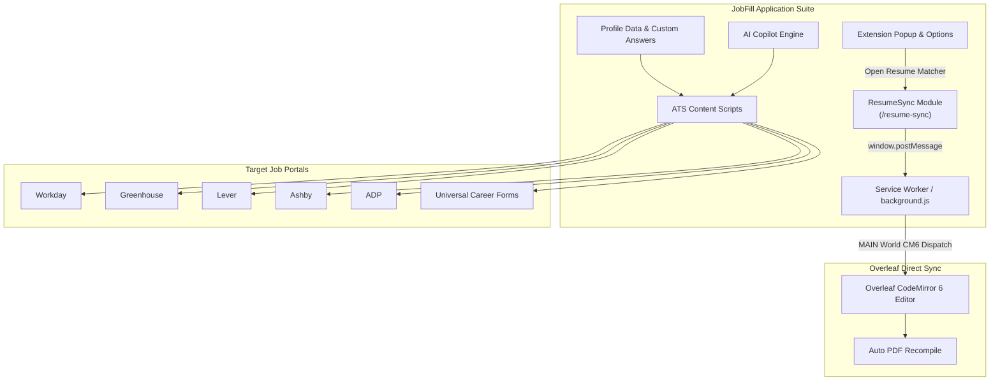

# JobFill AI ⚡

> **All-In-One Job Application Suite: 1-Click ATS Form Autofiller, AI Question Copilot, and Built-In ResumeSync ATS Tailoring Engine with Overleaf CodeMirror 6 Sync**

[](https://chrome.google.com/webstore)
[](https://developer.chrome.com/docs/extensions/mv3/intro/)
[](resume-sync/)
[](https://www.overleaf.com)
[](LICENSE)

---

## 📖 Overview

**JobFill AI** is a complete, all-in-one job application accelerator built on Chrome Extension Manifest V3. It combines two powerful systems in a single unified repository:

1. **JobFill Application Autofiller**: Intelligently detects and populates candidate profiles across Workday, Greenhouse, Lever, Ashby, ADP, TikTok, and universal career portals in 1 click, while answering complex short-answer and behavioral questions via its built-in AI Question Copilot.
2. **ResumeSync Engine (`/resume-sync`)**: A 100% client-side ATS optimization and LaTeX synchronizer. It analyzes any Job Description in 0 ms, dynamically reframes and reorders project bullets (Healthcare, Fintech, Data Eng, AI/ML), guarantees factual truth anchors ($R^2 = 0.88$, 17k records, IEEE CVMI-2023, GPA 3.85 / 8.93), and injects tailored LaTeX code directly into Overleaf via CodeMirror 6 transactional state dispatch.



---

## ✨ Key Features

### 1. 🚀 Universal 1-Click ATS Autofill
- **Specialized Adapters**:
  - **Workday**: Handles complex shadow DOMs, nested multi-step wizards, and custom dropdown pickers.
  - **Greenhouse**: Seamlessly populates required fields, LinkedIn/GitHub links, and demographic surveys.
  - **Lever**: Instant parsing and population of multi-part resumes and social links.
  - **Ashby**: Handles dynamic React-driven inputs and custom questionnaire blocks.
  - **ADP**: Supports legacy and modern enterprise portals.
  - **TikTok & ByteDance**: Custom form handler designed for complex multi-lingual career interfaces.
  - **Universal Fallback**: Heuristic keyword & regex field matcher that fills inputs on any standalone corporate portal.

### 2. 🤖 AI Question Copilot (`ai-copilot.js`)
- Contextually answers open-ended application questions directly inside the page:
  - **Work Authorization & Sponsorship**: Accurately fills US Citizenship, F-1 OPT/CPT, and H-1B sponsorship requirements according to your profile settings.
  - **Behavioral & Short Answer**: Generates punchy, authentic responses to questions like *"Why do you want to work here?"*, *"Describe a technical challenge you solved"*, or *"What is your expected compensation?"*.
  - **EEO / Diversity Demographics**: Auto-fills gender, race/ethnicity, and veteran status in accordance with user preferences.

### 3. 🎯 Built-In ResumeSync ATS Engine (`/resume-sync`)
- **0 ms Client-Side Execution**: Runs entirely in JavaScript without external AI API keys or network latency.
- **Dynamic Domain Classification & Project Rephrasing**:
  - **Healthcare & Bioinformatics**: Emphasizes missing-value imputation, regression modeling, data harmonization across 17,000+ clinical records, and technical documentation.
  - **Fintech & Quantitative Analytics**: Emphasizes quantitative demand forecasting ($R^2 = 0.88$), transactional reconciliation, and predictive risk scoring.
  - **Data Engineering & Cloud**: Highlights automated ETL validation, data hygiene, and telemetry pipeline fault tolerance.
  - **AI / Machine Learning**: Highlights modern NLP classification, candidate matching, and WebAssembly neural network inference.
  - **Full-Stack & Analytics**: Highlights client-side WebAssembly compute and real-time visualization.
- **Strict Anti-Hallucination & 1-Page Layout Lock**:
  - Core metrics ($R^2 = 0.88$, 17k records, IEEE CVMI-2023, GPA 3.85 / 8.93) remain strictly locked.
  - Bullet lengths constrained between 25 and 30 words to guarantee a clean 1-page output in Overleaf.

### 4. 📑 Overleaf CodeMirror 6 Transaction Engine (`background.js`)
- **Direct Memory Injection**: Dispatches atomic transactions into Overleaf's active editor session within Chrome's `MAIN` execution world:
  ```javascript
  view.dispatch({
    changes: { from: 0, to: view.state.doc.length, insert: latexCode }
  });
  ```
- **Auto-Wait & Recompile**: Detects if your Overleaf project is open; if not, opens it, waits for DOM completion, injects the updated resume, and clicks Overleaf's **Recompile** button automatically.
- **Fail-Safe Clipboard Copy**: Simultaneously copies the full LaTeX document to your clipboard for instant manual paste fallback via `Cmd+A` / `Cmd+V`.

### 5. ⚙️ Centralized Profile & Options Manager (`options.html`)
- Store and edit personal contact info, education, work history, projects, skills, and custom Q&A overrides.

---

## 🛠️ Unified Repository Structure

```
jobfill-extension/
├── manifest.json       # Manifest V3 configuration & web_accessible_resources
├── background.js       # Service worker: Tab management, CM6 script execution
├── content.js          # Main content script coordinator
├── content.css         # Autofill floating badges and field highlight styles
├── autofill-core.js    # Core DOM inspection and heuristic input mapper
├── ai-copilot.js       # Natural language answer generator for custom prompts
├── profile-data.js     # Default profile data schema and seed data
├── options.html / .js  # User settings, profile management, and Q&A configuration
├── popup.html / .js    # Quick extension action menu & Resume Sync launch button
├── sites/              # Dedicated portal adapters:
│   ├── workday.js
│   ├── greenhouse.js
│   ├── lever.js
│   ├── ashby.js
│   ├── adp.js
│   ├── tiktok.js
│   └── universal.js
├── icons/              # Extension brand assets (16px, 48px, 128px)
└── resume-sync/        # Built-in Resume Tailoring & Overleaf Engine
    ├── index.html      # Interactive tailoring UI (drag-and-drop PDF/DOCX)
    ├── app.js          # ATS keyword matcher, domain classifier, LaTeX serializer
    ├── styles.css      # Dark-mode glassmorphic styling & ATS score badge
    └── README.md       # Detailed documentation of the resume engine
```

---

## 📦 Installation & Setup

1. **Clone the Repository**:
   ```bash
   git clone https://github.com/Shivamshuroy448/jobfill-extension.git
   cd jobfill-extension
   ```
2. **Load into Google Chrome / Chromium**:
   - Navigate to `chrome://extensions/`.
   - Enable **Developer mode** (toggle in top right).
   - Click **Load unpacked**.
   - Select the `/Users/roy/projects/jobfill-extension` folder.
3. **Launch the Resume Tailorer**:
   - Click the **JobFill AI** extension icon and click **🎯 Resume Matcher & Sync**.
   - Or open `resume-sync/index.html` directly in your browser.

---

## ⚡ How to Use

### 1. Autofilling an Application:
1. Navigate to any job application page (Greenhouse, Lever, Workday, etc.).
2. Click the **JobFill AI** extension icon.
3. Click **1-Click Autofill** — all fields and custom questions will populate instantly.

### 2. Tailoring & Syncing Resume to Overleaf:
1. Click **🎯 Resume Matcher & Sync** from the extension popup (or open `resume-sync/index.html`).
2. Paste any target Job Description (or drag & drop a PDF / Word DOCX).
3. Click **⚡ 1-Click Sync & Recompile to Overleaf**.
4. The extension handles tab routing, injects the tailored LaTeX source code via CodeMirror 6, and initiates real-time PDF recompilation.

---

## 🤝 Contributing

Contributions, issues, and feature requests are welcome!

1. **Fork the Repository** on GitHub.
2. **Create a Feature Branch**:
   ```bash
   git checkout -b feature/amazing-feature
   ```
3. **Commit Your Changes**:
   ```bash
   git commit -m "feat: add amazing feature"
   ```
4. **Push to Branch**:
   ```bash
   git push origin feature/amazing-feature
   ```
5. **Open a Pull Request** against `main`.

---

## 📄 License

Distributed under the MIT License.
